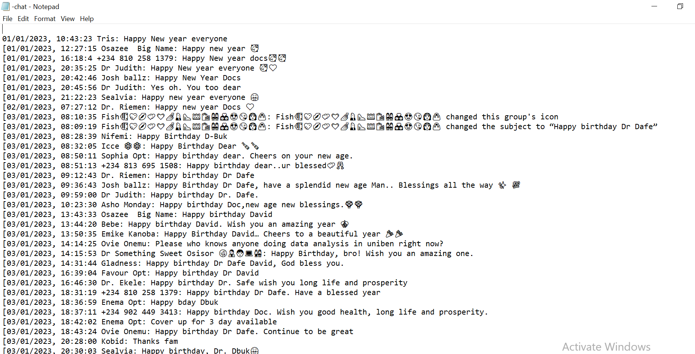
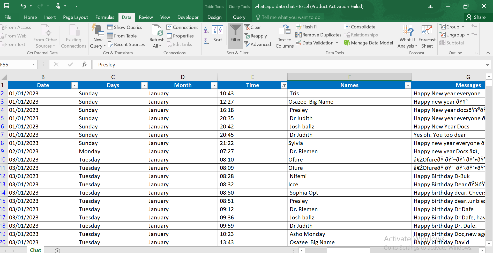
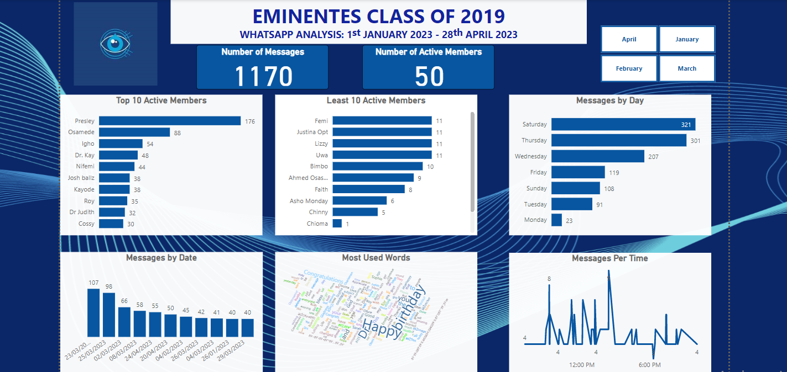

# Eminentes WhatsApp Chat Analysis
This project is to test my ability to work on .txt file documents (WhatsApp)

---

## Project Description
I challenged myself to work on and analyze data in a txt file from a WhatsApp group, I chose the most active group because the group has a lot of data for me to work with. Working on this project has helped me improve on my skill in working with unstructured dataset.

## Problem
The project is designed to find answers to these questions. Who are the most active persons in the group? Who are the least active persons in the group? 
What is the total number of contacts in the group? What is the total number of messages in the group from January to April 2023? To do this, a visualization of the monthly performance of the group will be needed as well as a visualization of the most used word by members of the group with a word cloud.

## Data Collection
WhatsApp data is gotten from the chat. Open the group chat, if using an iPhone scroll down to the bottom and click on export chat or if using an Android device click on the 3 dot above and export chat; select without media. Then save the chat and send to your laptop.

## Data Preparation
After exporting, the dataset is usually in a .txt file document, there is a need to process and put the data into a structured form. I used Power Query in Excel to transform the data into rows and columns.

--------

## Data Cleaning
Excel file was opened and there was a need to clean the sheet. Below are the steps done in cleaning the file:
•	Font style was changed to make all the same style and font.
•	Each column renamed was according to the data in each column. 
•	Renumbering of the serial number was done.
•	Separation of the “date” column into having “days” and “months” separately.
•	The data was screened for duplicates.
The data was saved to be visualized using PowerBI.

-------

## Data Analysis and Visualization
The dataset was uploaded into Power BI and on the Power query editor, I viewed the column quality to check that there were no errors in the columns.

-------

## Result
1. There are 50 active members in the group 
2. Presley, Osamede and Igho are the three most active members in the group with Presley having 15.04% of the overall messages.
3. There are 13 least active members in the group.
4. There are a total number of 1170 messages in the group.
5. March is the month with the highest Messages 625messages.
6. Saturday is the day with the highest activities with 321 messages and 46 active persons.
7. The most active time in the group is 2:23pm, followed by 9:08 am. 
8. **Happy**, **birthday** and **Dr.** seem to be some of the most commonly used words.
9. The time between 2:23pm and 8:50 pm happens to be the most active time in the group.
---

You can interact with the report [here](https://app.powerbi.com/view?r=eyJrIjoiMjcwZjY2ZDgtNjViZC00MTNhLTlkNWEtNDk2NGU4MjhlMmFiIiwidCI6IjdhMTVkMzY1LTc3YTgtNGEzOC1iN2QyLTJiYzg0ZjYzN2JhOCJ9)
